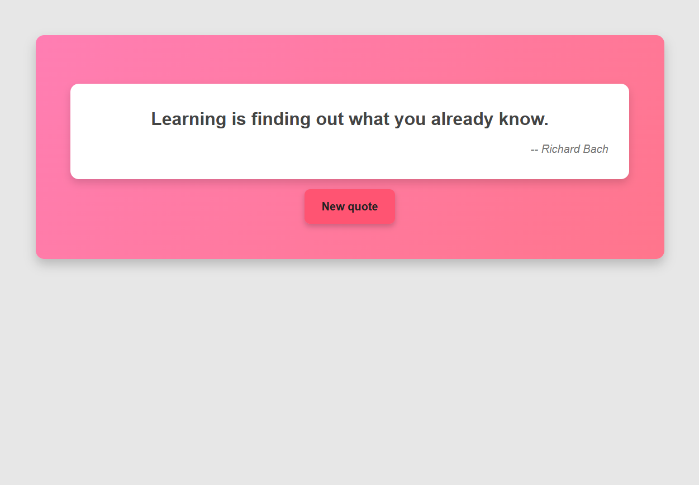

# Quotify - Random Quote Generator

A simple web application that generates random quotes.

## Live Demo
You can access the live demo of the project [here](#) https://qs-ashish05.github.io/quotify

## Look of the Webpage

Here’s a sample look of the webpage:

## Features
- Generates random quotes from the [Forismatic API](https://api.forismatic.com).
- Display quotes in a simple and clean interface.

## Technologies Used
- HTML
- CSS
- JavaScript
- Forismatic API (https://api.forismatic.com)

## API Details
The API used to fetch random quotes is the [Forismatic API](https://api.forismatic.com). The endpoint used is:

